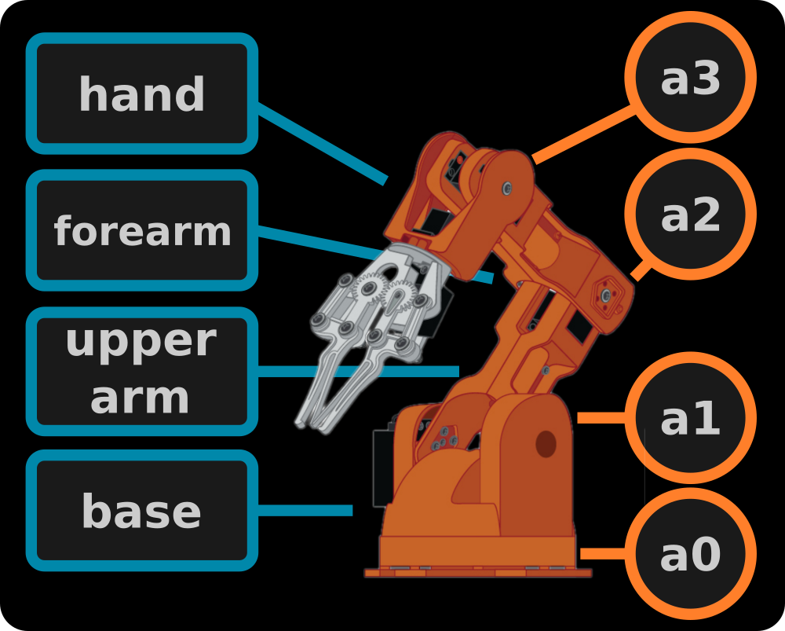
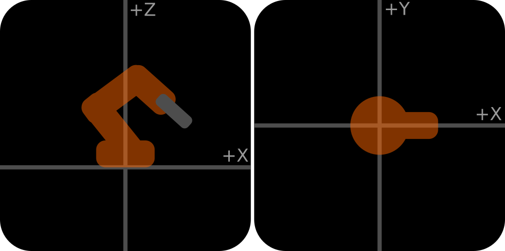
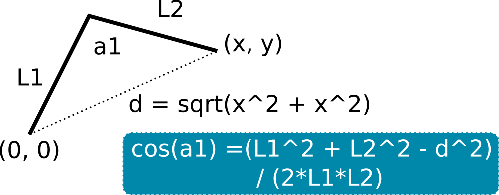

# Inverse Kinematic Library for Arduino

Calculates the inverse kinematics for a 3 links arm with a rotating base.
Tested with Arduino UNO and Teensy 3.6, with the robotic arm Arduino Braccio.

## How it works?



A `Link` is a straight line from one joint to another. We usually need the
length of `links` to calculate the inverse kinematics. For the braccio robot
arm, we have **4 links**: `base` that connects `a0` with `a1` with
a length of 0mm, `upperarm` that connects `a1` and `a2` with a length of 200mm,
`forearm` that connects `a2` with `a3` with a length of 200mm, and `hand` that
connects `a3` with the end effector with a length of 270mm.

Here, `a0`, `a1`, `a2`, and `a3` correspond to each servomotor of the arm.

To simplify calculations, we assume that the origin point starts at `a1` and
`a0` shares the same point with `a1` (link length of 0mm).

### Declaring Links

We can setup a link by declaring a variable of type `Link`:

```objectivec
Link myLink;
```

Then, we initialize the `Link` with the following values:

```objectivec
myLink.init(_length_, _min_angle_, _max_angle_);
```

Each angle is defined in **radians** and the length is defined in **mm**.

Finally, we attach each `Link` to the inverse kinematic solver:

```objectivec
InverseK.attach(base, upperarm, forearm, hand)
```

To get the inverse kinematic, first we need to define 4 float variables:

```objectivec
float a0, a1, a2, a3;
```

These variables are passed to the solver as pointers and their values are
modified by the solver when we call the following function:

```objectivec
InverseK.solve(_x_, _y_, _z_, a0, a1, a2, a3) // this returns TRUE or FALSE
```

If a specific approach angle `phi` is necessary (e.g. you need to approach a piece
from above), you can use:

```objectivec
InverseK.solve(_x_, _y_, _z_, a0, a1, a2, a3, phi) // this returns TRUE or FALSE
```

Here, `x`, `y`, and `z` and defined in **mm** and follow the system:



The solver will return `TRUE` if a solution is found and `FALSE` if there are
no solutions. In case of a `FALSE` return, the values of `a0`, `a1`, `a2`, and
`a3` are not guaranteed.


### What is the math behind the solver?

This solver basically uses the **Rule of Cosines** to find the angles that lead to
a specific coordinate in space.



To calculate the rotation angle of the base, the cartesian coordinate is transformed
to polar coordinates.


## Practical Example

```objectivec
// Include the library InverseK.h
#include <InverseK.h>

void setup() {
  // Setup the lengths and rotation limits for each link
  Link base, upperarm, forearm, hand;

  base.init(0, b2a(0.0), b2a(180.0));
  upperarm.init(200, b2a(15.0), b2a(165.0));
  forearm.init(200, b2a(0.0), b2a(180.0));
  hand.init(270, b2a(0.0), b2a(180.0));

  // Attach the links to the inverse kinematic model
  InverseK.attach(base, upperarm, forearm, hand);

  float a0, a1, a2, a3;

  // InverseK.solve() return true if it could find a solution and false if not.

  // Calculates the angles without considering a specific approach angle
  // InverseK.solve(x, y, z, a0, a1, a2, a3)
  if(InverseK.solve(550, 0, 50, a0, a1, a2, a3)) {
    Serial.print(a2b(a0)); Serial.print(',');
    Serial.print(a2b(a1)); Serial.print(',');
    Serial.print(a2b(a2)); Serial.print(',');
    Serial.println(a2b(a3));
  } else {
    Serial.println("No solution found!");
  }

  // Calculates the angles considering a specific approach angle
  // InverseK.solve(x, y, z, a0, a1, a2, a3, phi)
  if(InverseK.solve(550, 0, 50, a0, a1, a2, a3, b2a(90.0))) {
    Serial.print(a2b(a0)); Serial.print(',');
    Serial.print(a2b(a1)); Serial.print(',');
    Serial.print(a2b(a2)); Serial.print(',');
    Serial.println(a2b(a3));
  } else {
    Serial.println("No solution found!");
  }
}

void loop() {

}

// Quick conversion from the Braccio angle system to radians
float b2a(float b){
  return b / 180.0 * PI - HALF_PI;
}

// Quick conversion from radians to the Braccio angle system
float a2b(float a) {
  return (a + HALF_PI) * 180 / PI;
}
```

## How to install?
1. Download the project as a .zip file.
1. Open Arduino IDE
1. Select `Sketch->Include Library->Add .ZIP Library...`
1. Locate the .zip file you just downloaded (Should be named `CGx-InverseK-master.zip`)
1. Select the file and click `Open`
1. Ready!

**You can check the example sketch at:**
`File->Examples->CGx InverseK->CGx_InverseK_Example`

**If you want to control the arm using Gcode, check:**
[CGx-Gcode-RobotArm](https://github.com/cgxeiji/CGx-Gcode-RobotArm)

## Found any issues or questions?

Please post a [new issue](https://github.com/cgxeiji/CGx-InverseK/issues/new)
with your question or suggestion.

Pull requests are also welcomed.
